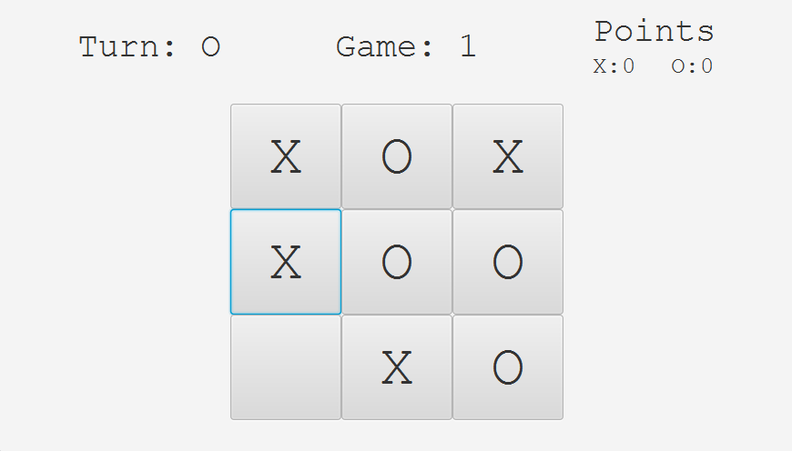
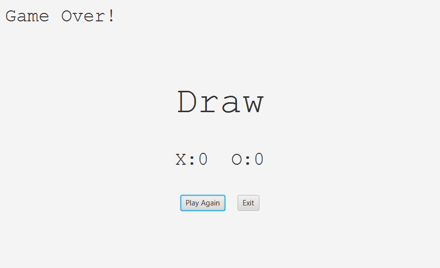
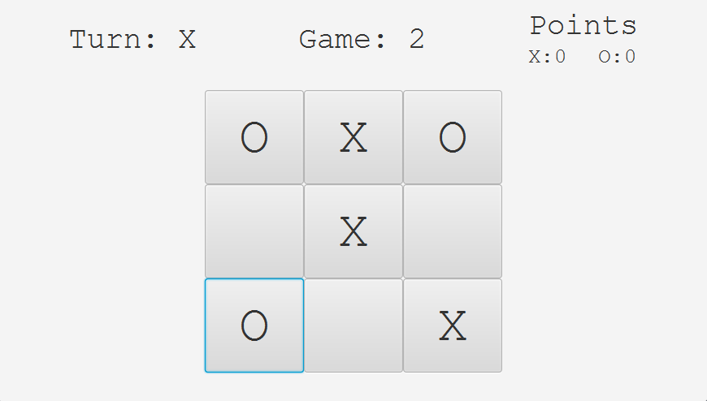
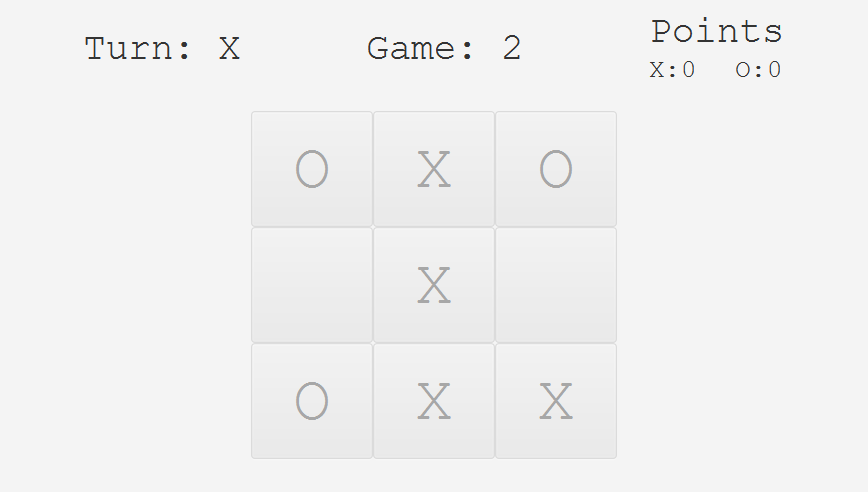
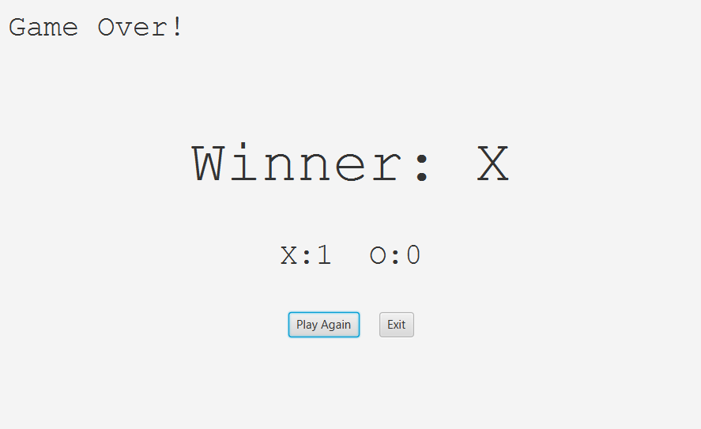
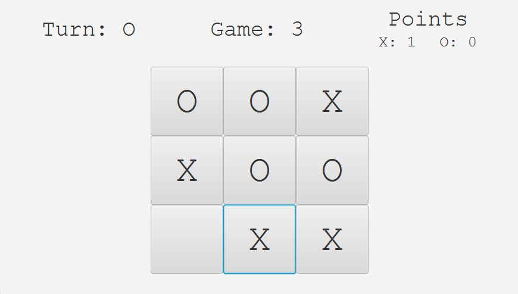

# Tic-Tac-Toe

A simple Tic-Tac-Toe game built with JavaFX. Play against a friend or practice your skills solo.

## Features

- Classic 3x3 Tic-Tac-Toe gameplay.
- Simple UI.
- Highlights the winner and prevents further moves once the game ends.
- "Play Again" button to quickly start a new game.

## Installation

Clone the repository to your local machine:

```bash
git clone https://github.com/MateoAgolli/Tic-Tac-Toe.git
```

Open the project in your preferred IDE (e.g., IntelliJ IDEA).  
Run the project using your IDE or by compiling it from the command line.

Alternatively, if you prefer to play directly, you can download the "Tic-Tac-Toe_Setup.exe" file from the [Releases](https://github.com/MateoAgolli/Tic-Tac-Toe/releases) section and run it.

## How to Play

- Players take turns marking a square on the 3x3 grid.
- The first player to align three of their symbols (X or O) vertically, horizontally, or diagonally wins.
- If all nine squares are filled without a winner, the game ends in a tie.
- Click the "Play Again" button to start a new game.

## Screenshots







## Credits

- **JavaFX**: Used for creating the graphics and UI components of the game.
- **Mateo Agolli**: Developer and creator of the game.
